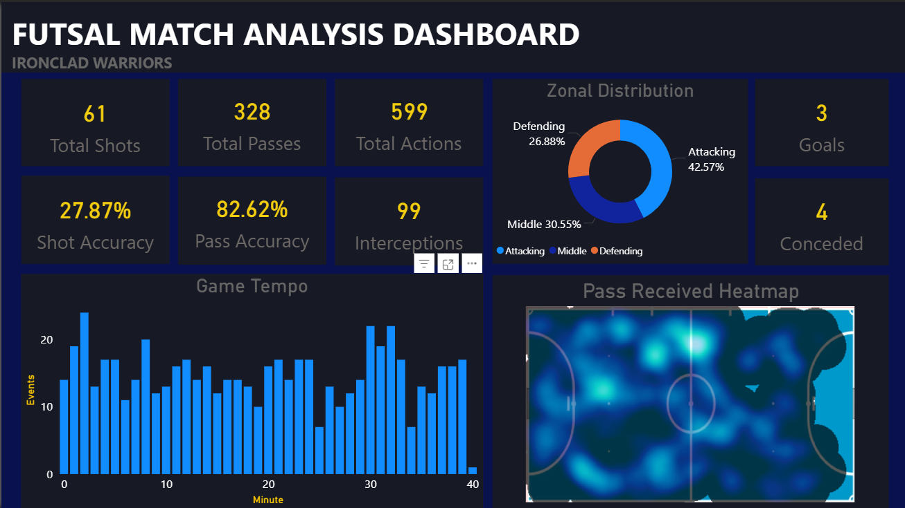
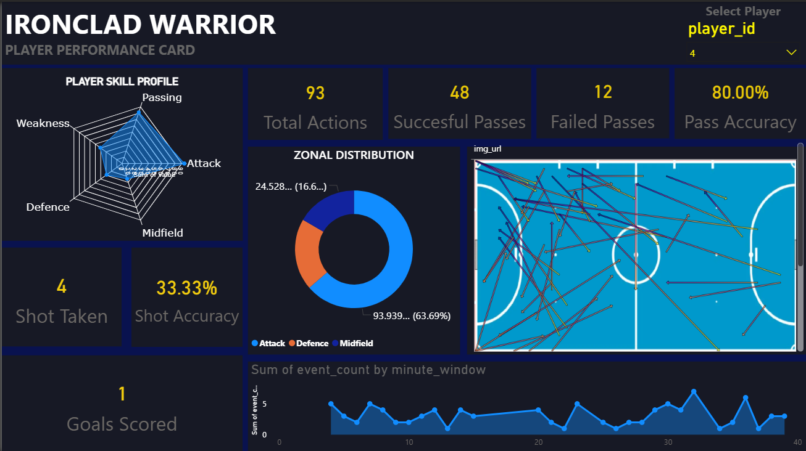

# Futsal Performance Analytics

### Real Match Data · PostgreSQL + PostGIS · Power BI · QGIS

\---



\---

## Overview

End-to-end performance analytics system built on **real Futsal match data — self-logged during a live professional game** using a custom event coding system designed from scratch.

> This is not a public dataset. Every row was recorded manually during an actual match.

\---

## What Makes This Different

Most sports analytics projects download data from public APIs or Kaggle.

This project starts one step earlier — **designing how to capture the data in the first place**, then building the entire analysis pipeline on top of it.

The pass lane geometry was built using **PostGIS spatial SQL** and visualized in **QGIS** — the same geospatial toolchain used in professional GIS and conservation mapping — then embedded directly into the Power BI dashboard.

\---

## Dataset

|Property|Value|
|-|-|
|Total events logged|599|
|Players tracked|9|
|Match halves|2|
|Fields captured|13|
|Data source|Self-logged during live professional match|

### Event Coding System — Designed From Scratch

|Code|Event|Spatial Data|
|-|-|-|
|PS|Pass Successful|Event XY + Receiver XY|
|PF|Pass Failed|Event XY|
|SS|Shot On-Target|Event XY|
|SF|Shot Off-Target|Event XY|
|INT|Interception|Event XY|
|LO|Lost Ball|Event XY|
|SV|Save|Event XY|
|G|Goal Scored|Event XY|
|CON|Goal Conceded|Event XY|

### Fields Captured Per Event

```
Match_id · Half · Display_Min · Display_Sec · Full_sec
Player_id · Reciever_id · Event_X · Event_Y
Reciever_X · Reciever_Y · Event_id · Pressure
```

`Event_X/Y` and `Reciever_X/Y` — spatial coordinates on the pitch for every action.  
`Pressure` — whether the player was under defensive pressure at the moment of action.

\---

## Dashboard

### Match Overview


**Key metrics visible:**

* 599 total actions · 328 passes · 61 shots
* 82.62% pass accuracy · 27.87% shot accuracy
* 99 interceptions · 3 goals · 4 conceded
* Zonal distribution — 42.57% Attacking / 30.55% Middle / 26.88% Defending
* Game tempo chart — event frequency per minute
* Pass received heatmap on actual pitch

\---

### Player Performance Card



**Interactive player selector — switch between all 9 players**

Each card shows:

* Player skill radar — Passing / Attack / Midfield / Defence / Weakness
* Total actions, successful passes, failed passes, pass accuracy
* Shot taken and shot accuracy
* Zonal distribution donut chart
* Pass lane map from QGIS embedded directly
* Player activity timeline per minute

\---

### Match Insights + AI Report


**AI-generated natural language insight — built entirely in SQL:**

> \*"The team showed high attacking volume, with good shot selection and strong forward passing. Additionally, controlled passing influenced overall performance."\*

Generated automatically from raw match statistics using SQL string concatenation — no external AI API. Pure logic built on top of calculated metrics.

Also includes:

* Event heatmap on pitch — density by location
* Spatial point map — every event plotted on actual pitch coordinates
* Per-event contextual insight — selectable by event type

\---

## Pass Lane Analysis — PostGIS + QGIS

Pass lanes were built using **PostGIS spatial geometry** — each pass converted into an actual geometric line using start and end coordinates.

```sql
ST_MakeLine(
    ST_SetSRID(ST_Point(event_x, event_y), 4326),
    ST_SetSRID(ST_Point(reciever_x, reciever_y), 4326)
) AS geom
```

Exported from PostgreSQL → visualized in **QGIS** → embedded in Power BI per player.

Pass lane images per player available in `assets/images/`

\---

## Analysis Modules

### 1\. Performance Summary

* Total actions per player
* Goals, shots on target, successful passes, interceptions
* Events under pressure per player

### 2\. Weakness Profiling

* Possession losses per player
* Pass failure rate
* Shots off target

### 3\. Time-Based Analysis

* Game tempo — event frequency per minute window
* Mistake-to-shot chain — time between error and resulting shot
* Defensive transition timing using `LEAD` window function

### 4\. Goal Involvement

* Scorer identification
* Assist and pre-assist tracking using `LAG` window functions

### 5\. Spatial Zone Analysis

* Pitch divided into Attacking / Middle / Defending thirds
* Most active player per zone
* Zone distribution percentages across match

### 6\. Pass Distance \& Progression

* Euclidean distance per pass
* Progressive pass percentage
* Pass lane geometry via PostGIS

### 7\. Pressure Analysis

* Success rate under defensive pressure
* Pressure vs non-pressure performance

### 8\. AI Insight Generation

* Automated natural language match report
* Shot quality scoring based on distance from goal
* Pass fail rate classification
* Attacking volume assessment

\---

## Key SQL Techniques

```sql
-- Window Functions
LAG(player_id, 1) OVER (ORDER BY full_sec) AS assist_player
LEAD(full_sec) OVER (ORDER BY full_sec) - full_sec AS time_to_next_event

-- CTEs
WITH recovery_diff AS (
    SELECT player_id, event_id, full_sec,
    LEAD(full_sec) OVER (ORDER BY full_sec) - full_sec AS time_to_next_event
    FROM futsal_raw_data
)

-- PostGIS Spatial
ST_MakeLine(
    ST_SetSRID(ST_Point(event_x, event_y), 4326),
    ST_SetSRID(ST_Point(reciever_x, reciever_y), 4326)
) AS geom

-- AI Insight Generation
'The team showed ' || volume_text || ', with '
|| shot_text || ' and ' || pass_text || '...' AS final_insight

-- Normalization
defence_zone * 100.0 / NULLIF(MAX(defence_zone) OVER(), 0) AS defence_norm
```

\---

## Tech Stack

|Category|Tool|
|-|-|
|Database|PostgreSQL|
|Spatial Extension|PostGIS|
|Query Language|SQL — CTEs, Window Functions, Views|
|Spatial Visualization|QGIS|
|Dashboard|Power BI|
|Spatial Functions|ST\_MakeLine · ST\_Point · ST\_SetSRID|
|Data Format|CSV / Excel|

\---

## Repository Structure

```
futsal\_analysis/
│
├── data/
│   ├── raw/
│   │   └── futsal_data.xlsx         ← Original self-logged match data
│   └── processed/
│       └── (exported query outputs)
│
├── sql/
│   └── futsal_analysis.sql          ← Complete analysis — 8 modules
│
├── powerbi/
│   └── PB\_futsal\_analysis.pbix      ← Power BI dashboard
│                                       (open with Power BI Desktop)
│
├── assets/
│   ├── dashboard/
│   │   ├── overview_team.png        ← Match overview dashboard
│   │   ├── player_stats.png         ← Player performance card
│   │   └── insights_with_AI.png     ← AI insights page
│   └── images/
│       ├── P_1_pass_lane.png
│       ├── P_4_pass_lane.png
│       ├── P_8_pass_lane.png
│       ├── P_10_pass_lane.png
│       ├── P_16_pass_lane.png
│       └── P_18_pass_lane.png
│
├── docs/
│   └── methodology.md               ← Data collection methodology
│
└── README.md
```

\---

## Methodology

Data was collected during a live professional Futsal match using a custom manual logging system. For each observable event:

1. Time recorded — minute, second, full elapsed seconds
2. Player identified by jersey number
3. Action coded using the custom event system
4. Pitch coordinates estimated on grid for event and receiver location
5. Defensive pressure assessed at moment of action

This captures spatial, temporal, and contextual data simultaneously — enabling analysis types not possible with standard event-only datasets.

Full methodology: [docs/methodology.md](docs/methodology.md)

\---

## Author

**Om Narawade**  
BSc Data Science — Savitribai Phule Pune University, Pune  
[LinkedIn](https://www.linkedin.com/in/om-narawade-0a992a248) · [GitHub](https://github.com/narawadeos13)

